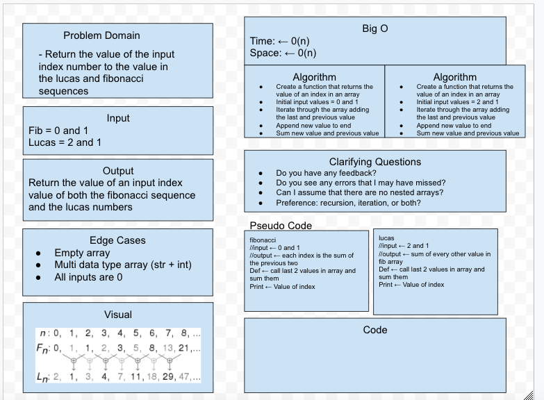

# Modules, Containers, and Testing

## Challenge Description
Create a function called `fibonacci`. The function should have one parameter `n`. The function should return the nth value in the fibonacci series. You may implement the function using recursion or iteration.

In your `series.py` module, add a new function `lucas` that returns the nth value in the lucas numbers 

Add a third function called `sum_series` with one required parameter and two optional parameters. The required parameter will determine which element in the series to print. The two optional parameters will have default values of 0 and 1 and will determine the first two values for the series to be produced.

Calling this function with no optional parameters will produce numbers from the fibonacci series. Calling it with the optional arguments 2 and 1 will produce values from the lucas numbers. Other values for the optional parameters will produce other series.

## Approach & Efficiency
I used a recursive function to use values to create a call stack that then adds the values together as they are called.

The final value will represent the value at the iteration of both the fibonacci sequence and the lucas numbers.

Finally I created a function that sums the called values in both the fibonacci sequence and lucas numbers.

## Solution

[Pull Request 1](https://github.com/NickDorkins/math-series/pull/1)